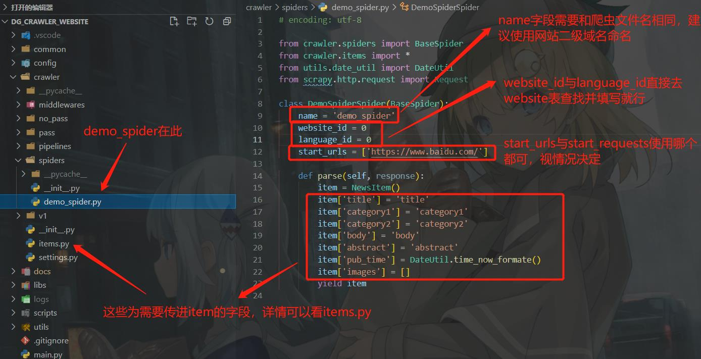
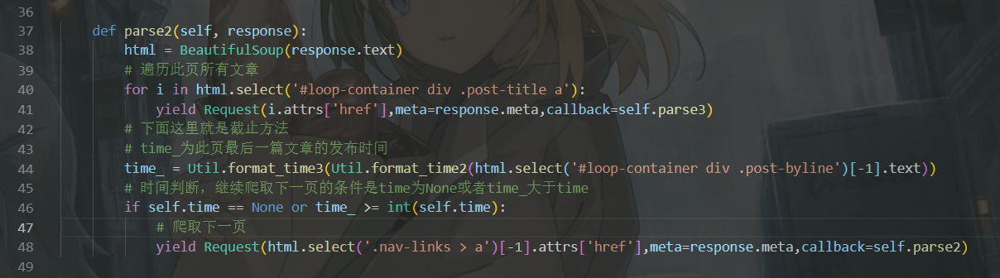

# dg_crawler_website文档

## 一、项目环境搭建

&nbsp;

### 1. 本地测试环境

在项目`根目录`运行如下命令：(根目录就是dg_crawler_website)

    pip install -r requirements.txt
    python scripts/config_pull.py

根据自身需求修改 config/ 文件夹内以_config.py结尾的文件，例如将db_config里的00测试库换成自己的测试用数据库

使用crawler/spiders/demo_spider.py作为模板写爬虫，并将写好的爬虫放置在crawler/spiders目录下

可使用以下测试命令测试爬虫文件：

    1. scrapy crawl xxx -a db=00 -a proxy=00 -a time=days_ago:1
    2. scrapy crawl xxx

其中db、proxy、time是可选参数，默认为db=00，proxy=00，time=None

运行的log会存在LOG_DEFAULT_HOME下

ps: 注意，爬虫测试现在暂时需要链接校园网使用; 

或者搭建本地MySQL数据库，做本地测试。

&nbsp;

### 2. 线上部署

运行如下命令：

    sudo apt update
    sudo apt install git

然后在项目根目录运行如下命令：

    pip install -r requirements.txt
    python scripts/config_pull.py

单独开一个进程在项目根目录运行：

    python -m main

再另外开进程或者使用crontab运行scripts里需要的脚本

### 3、配置本地git环境与提交代码

参考博客：
1. [Git&Github从精通到不会](https://zhuanlan.zhihu.com/p/392095155)
2. [Pycharm | 使用自带的git图形工具push代码](https://blog.csdn.net/m0_46156900/article/details/121857440)

&nbsp;

### * 4、搭建与配置本地MySQL测试数据库
1. 搭建本地MySQL数据库，建库建表。

参照网上的教程，比如[菜鸟教程](https://www.runoob.com/mysql/mysql-install.html) 使用 ***安装包*** 的方式，搭建MySQL

使用`navicat`工具或其他操作mysql的工具、或命令行。

执行sql文件:`dg_db_website.sql` (在docs文件夹下)

2. 修改`db_config.py`

注意不是修改`host_config_default.py`
>如果没有`db_config.py` ，请参考上面的`在项目根目录运行如下命令`

修改'01'对应的数据库配置，修改成你自己的用户密码。
> 启动爬虫的时候，默认使用`01`数据库配置
## 二、项目目录介绍

### 1.common

常量文件目录，项目中使用到的一些重用率很高且极少更改的常量放置于此，例如不同语种月份映射表

### 2.config

设置文件目录，一些在不同环境中经常修改的数据放置于此，便于调试，例如数据库配置

### 3.crawler

scrapy爬虫主目录，懂得都懂

+ middlewares:  放middleware的文件夹
+ no_pass:      撤下部署的爬虫文件
+ pass:         放以部署进服务器的爬虫文件
+ pipelines:    放pipelines的文件夹
+ spiders:      这不用我介绍了吧
+ v1:           v1版本爬虫文件

### 5.docs

放项目相关文档的，例如此文档

### 6.libs

插件目录，一些独立于scrapy的插件可以放于此

### 7.logs

日志目录，项目里不自带，不过运行起来后会生成，可以在config自行设置日志路径，默认为./logs

### 8.scripts

脚本文件目录，放一些脚本的

### 9.utils

工具文件目录，项目中使用到的一些重用率很高且极少更改的代码片段放置于此，例如日期格式化逻辑

### 10. main.py

框架主逻辑入口文件

## 三、如何写一个爬虫

框架内一律使用 crawler/spiders/demo_spider.py 此文件作为所有爬虫的模板

&nbsp;

### 爬虫规范

1. 代码里重用率很高的常量放到common文件夹下调用
1. 代码里重用率很高的代码片段放到utils文件夹下调用
1. 开发的爬虫要能够爬取网站上的大部分文章且达到90per的无报错率，可以在logs下看报错日志
1. 爬虫内尽量不要使用requests库，所有请求都由scrapy框架实现
1. 开发好的爬虫需要放入spiders文件夹使用git提交进仓库里，或者交给鼎谦帮忙提交
1. 开发的爬虫需要有时间截止功能，也就是只搜索并爬取指定时间以后的文章，来节省爬虫运行开支，这里以boholchronicle.py为例：

其中time为爬虫启动时会传入的参数，为int类型时间戳，简单来说就是通过文章的日期来判断是否翻页

&nbsp;

### 进阶玩法

1. 请求头和cookie：
我们的爬虫一律继承自 crawler.spiders.BaseSpider 类，其中有make_header与make_cookie函数，可以通过覆写这两函数或者在meta中传key为Headers或Cookies字段来为爬虫或请求定制header与cookie。
除此之外，可以修改 settings_config 中的 BASE_DEFAULT_REQUEST_HEADERS 字段来更改默认请求头用于测试
2. 测试：
使用vscode的同学可以将 scripts 文件夹下的 launch.json 文件移动到 .vscode 文件夹下进行快捷调试，还可以通过修改 config 文件夹下以config.py结尾的文件配置来方便调试
3. 这里并不限制对爬虫文件以外的地方进行修改，如有必要，可以自行定制相应的中间件与pipeline给爬虫，以及对框架的修改优化，欢迎大家参与到框架的编写中来
